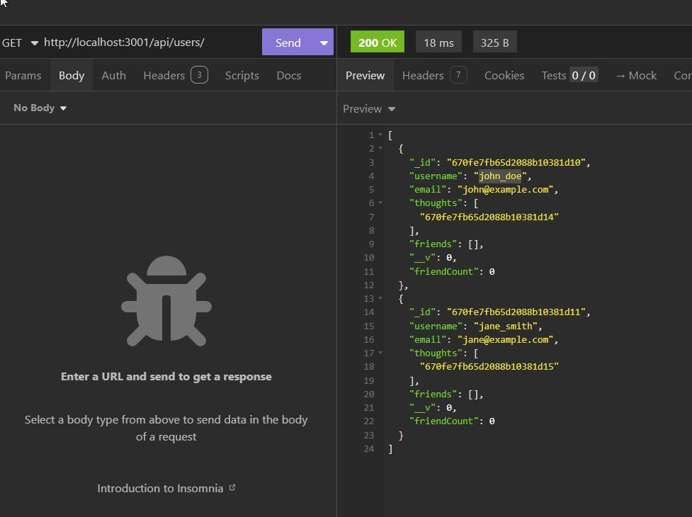

# Social Network API

## Description

This API provides a robust means of creating, modifying, and deleting new users, adding and modifying new thoughts, or adding/removing reactions to those thoughts. This application depends on MongoDB for data storage, and as it has no front end components, and testing needs to be done through applications such as Insomnia.

## Table of Contents (Optional)

If your README is long, add a table of contents to make it easy for users to find what they need.

- [Social Network API](#social-network-api)
  - [Description](#description)
  - [Table of Contents (Optional)](#table-of-contents-optional)
  - [Installation](#installation)
  - [Usage](#usage)
  - [Credits](#credits)
  - [License](#license)
  - [Tests](#tests)

## Installation

- npm init -y
- npm install mongoose express
- make sure MongoDB is running
- (optional) npm run seed
- npm start
  This application uses mongoose for data storage and express for routing purposes. NPM run seed will seed the database with example data.

## Usage

The repository for this code can be found [here](https://github.com/cbaumgart004/socialApi)
There is no front-end aspect to this application, but using tools such as insomnia, you can send several different requests to perform the following actions:

- View All Users
- View a specific User by ID
- Get all Thoughts
- Get a specific thought by ID
- Create a new User
- Create a new Thought
- Update a User by ID
- Update a Thought by ID
- Delete User by ID
- Delete Thought by ID
- Add a Friend to a User
- Remove a Friend from a User
- Add a Reaction to a Thought
- Remove a Reaction from a Thought
  An example of a GET request can be seen
  

## Credits

This API was developed by [Chris Baumgart](https://github.com/cbaumgart004) and was modeled after Mongoose Activities learned in class.

## License

This API is licensed with an MIT license, and can be viewed [here](https://github.com/cbaumgart004/socialApi/blob/main/LICENSE)

## Tests

Below are Examples of the Requests you can do, with some example JSON text bodies.
Get all users

GET http://localhost:3001/api/users

Get a user by ID

GET http://localhost:3001/api/users/:id

Get all thoughts

GET http://localhost:3001/api/thoughts

Get a single thought by ID

GET http://localhost:3001/api/thoughts/:id

Create a new user

POST http://localhost:3001/api/users

{
"username": "newuser",
"email": "newuser@example.com"
}

Create a new thought

POST http://localhost:3001/api/thoughts

{
"thoughtText": "This is my new thought!",
"username": "newuser",
"userId": "616a26b16a5a9f430a5a2c12" // Use the User ID here
}

Update a user by ID

PUT http://localhost:3001/api/users/:id

{
"username": "updateduser",
"email": "updateduser@example.com"
}

Update a thought by ID

PUT http://localhost:3001/api/thoughts/:id

{
"thoughtText": "This is my updated thought!",
"username": "updateduser" // Use the new User ID here
}

Delete a user by ID
DELETE http://localhost:3001/api/users/:id

Delete a thought by ID
DELETE http://localhost:3001/api/thoughts/:id

Add a friend to a user

PUT http://localhost:3001/api/users/:id/friends/:friendId

Remove a friend from a user

DELETE http://localhost:3001/api/users/:id/friends/:friendId

Add a reaction to a thought

POST http://localhost:3001/api/thoughts/<thoughtId>/reactions

{
"reactionBody": "This is a reaction!",
"username": "reactionUser"
}
Remove a reaction from a thought
DELETE http://localhost:3001/api/thoughts/670fe7fb65d2088b10381d15/reactions/670ff57fc17f261c33c6eff1

DELETE http://localhost:3001/api/thoughts/<thoughtId>/reactions/<reactionId>
